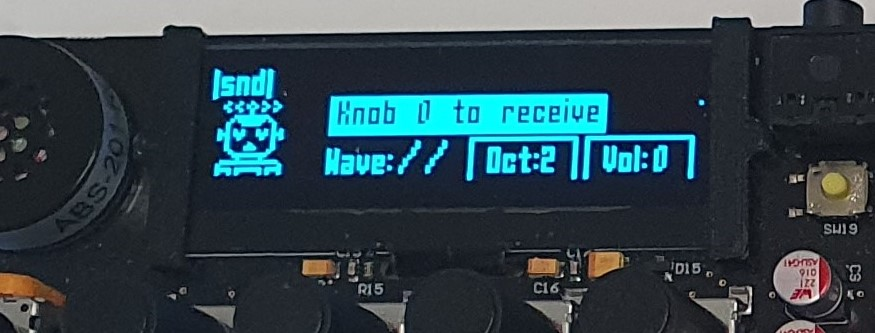

# charIOT-Key-C

## Table of Contents

<p style="padding-left:5%">
  <a href="#introduction">- Introduction</a>
  <br>
  <a href="#hardware-and-functionality">- Hardware and Functionality</a>
  <br>
  <a href="#advanced-features">- Advanced Features</a>
  <br>
  <a href="#timing-analysis">- Timing Analysis</a>
</p>

# Introduction
<div align=center>
  <a href="https://imperiallondon.sharepoint.com/:v:/r/sites/charIOT-EE/Shared%20Documents/General/Embedded-LiveVideo-doubleDEMO.mp4?csf=1&web=1&e=f771Mp"> Click here for DEMO videos</a>
  <p></p>
  
  <a href="https://imperiallondon.sharepoint.com/:v:/r/sites/charIOT-EE/Shared%20Documents/General/Embedded-KEYS-Features.mp4?csf=1&web=1&e=bOCvlk" target="_blank">
    
  </a>

  (Click on image to check out a Sharepoint Features Presentation video)

</div>

---

This repo contains the code and documentation for the second coursework of the <b>Imperial College London ELEC60013 Embedded Systems course </b> taught by Dr. Ed Stott. The coursework is focused on writing code for an STM32 Microcontroller connected to a StackSynth synthesizer. The finalized synthesizer supports polyphony, different waveforms, different octaves, connecting a synth to other synths using CAN and a 44.1kHz sampling frequency.

The project is built using <b>STM's CubeIDE</b> - meaning you need an installation of <b>CubeIDE</b> to build and run the project (or some experience with makefiles and the ARM compiler toolchain!).

> **Warning for earphone & headphone users**
> 
> If using earphones or headphones, pay attention to how loud the volume is set. The default volume values was optimised for the speaker.
>
> We recommend using headphones for experiencing the best sound quality.

The main source files of the project are as follows:

- <a href="./Core/Inc/main.h">main.h</a> and <a href="./Core/Src/main.c">main.c</a>: Main project module which instantiates hardware, the relevant RTOS tasks, mutexes etc. Additionally, main contains a few simple RTOS tasks e.g. to read the keys and knobs of the synthesizer and a few HAL interrupt callback definitions.
    
- <a href="./Core/Inc/wavegen.h">wavegen.h</a> and <a href="./Core/Src/wavegen.c">wavegen.c</a>: Code for generating wavetables, displaying which wavetable is currently active and writing the current waveform to the DAC using DMA. The algorithm for generating the waveform is explained in INSERT HERE
    
- <a href="./Core/Inc/cann.h">cann.h</a> and <a href="./Core/Src/cann.c">cann.c</a> contain the code for handshaking with other synthesizers as well as receiving and sending messages using CAN.
    
- <a href="./Core/Inc/hardware_config.h">hardware_config.h</a> and <a href="./Core/Src/hardware_config.c">hardware_config.c</a> contains the code to set up the various hardware components e.g. hardware timers, the DAC, ADC etc.

# Hardware and Functionality

<div align=center>
    
</div>

The STM32 NUCLEO-L432KC board includes many peripherals, some of which are put to use in this project:

- A 12-bit DAC for audio samples output.
- GPIOs for reading user inputs and handshaking.
- An I2C peripheral to control the screen.
- A CAN peripheral to communicate between synth modules.
- DMA channels to output audio samples directly from memory, as well as memory-to-memory array copying.
- Timers for audio sampling, microsecond counting and execution time measurements.

A two-channel 12-bit ADC was also setup but does not currently have any use.

### Pinout configuration table and their specific definitions:

As given in the <a href="https://github.com/edstott/ES-synth-starter/blob/master/doc/LabPart1.md">instructions</a> we follow the following configurations for our pins.

| [RA2,RA1,RA0] | C0 | C1 | C2 | C3 |
| :-------------: | -- | -- | -- | -- |
| 0	| Key C	| Key C♯	| Key D	| Key D♯ | 
| 1	| Key E	| Key F	| Key F♯	| Key G | 
| 2	| Key G♯	| Key A	| Key A♯	| Key B | 
| 3	| Knob 3 A	| Knob 3 B	| Knob 2 A	| Knob 2 B | 
| 4	| Knob 1 A	| Knob 1 B	| Knob 0 A	| Knob 0 B | 
| 5	| Knob 2 S	| Knob 3 S	| Joystick S	| West Detect | 
| 6	| Knob 0 S	| Knob 1 S	| Unused	| East Detect | 
| 7	| Unused | Unused | Unused | Unused |

## Sender and Receiver

The synthesizer can be configured as either a `sender` or `receiver`. In `sender` mode, any key presses are sent via CAN to other synthesizers. There can be an arbitrary number of senders and receivers.

The `sender` will not play any audio itself. A `receiver` will play any keys pressed on its own keyboard as well as any keys received from other synthesizers. The `receiver` will always play the keys with the waveform and volume it is itself configured to use. The octave of the key played will naturally depend on the position of synthesizer sending the key. 


# Advanced Features

## ***1. 44.1kHz, 12-bit audio polyphony***

The synth operates on a sampling frequency of 44.1kHz and uses the full 12-bit resolution of the DAC, together with at least 10 keys polyphony in a 3 keyboard configuration.

Such a features requires efficient calculation of audio samples. In this project, a double buffering method is used jointly with memory-to-peripheral DMA for maximum performance. While DMA does not reduce the number of calculations, it drastically reduces the need for context-switching as the CPU can simply write into a buffer and let the DMA-controller write entry-by-entry to the DAC.

The generation of audio samples relies on a lookup table architecture similar to the one found in many dedicated direct digital synthesis (DDS) hardware, such as the AD9838 from Analog Devices, whose functional block diagram is shown below.

<div align=center>
    
</div>

This DDS uses a high resolution phase accumulator, the value of which is downshifted and used as an address in a ROM. This allows for high frequency resolution and low memory usage, at the slight cost of a marginal increase in quantisation error.

Unlike the DDS, the synthesiser will need to generate sums of waveforms as well as individual forms. This hints at the use of one phase accumulator for each key. However, since keys differing by one octave differ by a factor of two in frequency, hence in step size, only 12 indices are actually needed. To prevent indiscriminate additions of indices even for keys that are not pressed, the key array, which contains one element per keyboard, is rotated into a notes array, which contains one element per note (Do, Re, etc.).

The step sizes are generated for octave 7 and shifted down accordingly to allow for minimal loss in resolution. Assuming a 16-bit accumulator, the step sizes can be calculated as:

<div align=center>

$\mathrm{step[i]}=\displaystyle \frac{3520\times2^\frac{i-9}{12}}{44100}\times2^{16}$
</div>

The overall algorithm does not use any multiplication, division or modulo operations, only integer addition, subtraction, bit shifting and bitwise AND operations.

The `synthesise_output1()` and `synthesise_output2()` functions implement the algorithm discussed above.
```c
inline void synthesise_output2()
{
    [...]

    // Notes array - each element of the array is a bitarray showing all the keyboards on which
    // a note is played. E.g. localNotes[0] is a bitarray indicating if C is played for keyboards
    // 1-8.
    uint8_t localNotes[12];

    [...]

    // position-octave difference
    uint8_t localDiff = __atomic_load_n(&pos_oct_diff, __ATOMIC_RELAXED);

    uint8_t localVolume = __atomic_load_n(&volume, __ATOMIC_RELAXED);

    for (int i = DDS_OUT_SAMPLES / 2; i < DDS_OUT_SAMPLES; i++)
    {
        int32_t out = 0;
        for (int key = 0; key < 12; key++)
        {
            if (localNotes[key])
            {
                DDS_indices[key] += DDS_steps[key];
                for (int board = 0; board < keyboard_count; board++)
                {
                    if (localNotes[key] & (1 << board))
                    {
                        out += DDS_LUT_SEL[(DDS_indices[key] >> (13 - board + localDiff)) & 0x03FF];
                    }
                }
            }
        }
        DDS_OUT[i] = ((uint16_t)(out >> (12 - localVolume))) + 2048;
    }
}
```

## ***2. Unique Wave Forms***

The synthesizer generates a sound output based on a wavetable which is generated at bootup. Below is a list of the different waveforms that the synthesizer can output. The user can select which waveform to play using the second knob from the left.   

<table align=center>
  <tr display="flex" flex-direction=row align-content=center >
    <th>
      
      <p>Sawtooth wave</p>
    </th>
    <th>
      
      <p>Sine wave</p>
    </th>
  </tr>
  
  <tr display="flex" flex-direction=row align-content=center >
    <th>
      
      <p>Square wave</p>
    </th>
    <th>
      
      <p>Triangle wave</p>
    </th>
  </tr>

  <tr display="flex" flex-direction=row align-content=center >
    <th>
      
      <p>Clarinet wave</p>
    </th>
    <th>
      
      <p>Retro 1 wave</p>
    </th>
  </tr>

  <tr display="flex" flex-direction=row align-content=center >
    <th>
      
      <p>Retro 2/Electric Guitar wave</p>
    </th>
  </tr>
</table>

When switching between different waveforms, the buffer of the output waveform is overwritten using DMA:

```c
// Lookup tables for the different types of wave that can be produced
// e.g. sine, sawtooth, clarinet etc.
int16_t DDS_LUT[END_WAVETYPE][DDS_LUT_SAMPLES];
int16_t DDS_LUT_SEL[DDS_LUT_SAMPLES];

...

void set_output_waveform(WaveType wave) {
    // change only if different
    if (output_wavetype == wave) {
            return;
    }
    output_wavetype = wave;

    // start M2M DMA transfer
    HAL_DMA_Start_IT(&hdma_memtomem_dma1_channel1, (uint32_t) DDS_LUT[wave],
                    (uint32_t) DDS_LUT_SEL, DDS_LUT_SAMPLES);
}
```

This is crucial, as it frees the CPU up from what would otherwise have been a time-consuming memcpy.


-----------------------

## ***3. Synchronisation of octaves***

The keyboards synchronise their state with the others on startup or restart. After a couple of seconds after startup, we can notice the octaves updating from the local value of 4 to the synchronised values depending on the number of keyboards connected at the time of the startup.

<table>
  <tr>
      
      <p>1) When we power the keyboards connected, their octaves will synchronise and will update from left to right as 2-3-4</p>
  </tr>
  <tr>
      
      <p>2) At any point during the usage, we can change the octave of the receiver board through rotating the knob. The octaves of the other boards will then update considering their relative waves to the receiver board.</p>
  </tr>
  <tr>
      
      <p>3) We continue rotating the octave knob and reach the maximum combination of octaves 6-7-8 that we allow in our system.</p>
  </tr>
</table>

## ***4. Interactive Display***

<div align=center>
    
    
</div>

The display shown in the pictures above presents the following features:

- on startup, all connected displays show the keyboards' states of `sender`.
- when the Knob 0 is pressed, the display changes the keyboard status in top left to `receiver`.
- next to the keyboard status, on the top line, we can see all notes pressed on that specific keyboard. (each keyboard shows their pressed keys)
- on the bottom line, from left to right, there is the current wave displayed with a representive icon, the current octave of the assigned to the keyboard and the volume of the keyboard.
- in the bottom left corner, there is our mascot `CharKEY` that sings along with the pressed keys 

> **Observation**: Noise generated by the display
>
> The display was noticed to introduce noise in the sound generated. The noise is noticeable in the speaker, but especially when using the 3.5mm headphone jack.  
> The more pixels the display would use, the greater the noise generated.

# Timing Analysis

There are 6 main tasks handled by CMSIS RTOS:

- The (two) output tasks achieve the function of double buffering by calculating audio samples when triggered by the appropriate event flag. Its initialisation interval is given by the half buffer size divided by the sampling frequency: $\frac{2048}{44100}=46.4\mathrm{ms}$
- The display task updates the OLED display, with an initialisation interval of 100ms.
- The scan keys task checks for user input (keys and knobs), with an initialisation interval of 20ms.
- The CAN TX task transmits message via CAN. Its expected initialisation interval is 20ms, since the scan keys task sends a CAN message each time keys are scanned.
- The CAN decode task processes the CAN messages received. For a 3 keyboard configuration, its expected initialisation interval is 10ms, since the other two keyboards each send a CAN message every 20ms.
- The CAN handshake task performs handshaking once at boot. During operation, the task simply checks for the sender / receiver selection every second.

Additionally, there are 4 interrupts handled by the NVIC:

- The half conversion complete callback is called when the DMA is finished with transfering the first half of the output audio buffer. It simply raises a flag which triggers the output task.
- The full conversion complete callback is called when the DMA is finished with transfering the second half of the output audio buffer. It simply raises a flag which triggers the output task.
- The CAN RX message pending callback is called when a message is received via CAN. It places the message in a queue.
- The CAN TX complete callback is called when the transfer of a message is complete. It simply gives back a semaphore.

Semaphores, mutexes and queues are used for thread-safe programming. For example, the keys array is protected with a mutex, queues are used to transmit and receive CAN messages, and sempahores are used to control access to the CAN bus.

The execution time of each task was measured and listed in the table below. Note that the execution time of the conversion complete and CAN TX interrupts are too insignificant to be measured.

<div align=center>

| Task name   | Initiation interval (ms)  | Execution time (ms) |
| :--:        | --                        | --                  |
| output      | 46.4                      | 32.8                |
| display     | 100.0                     | 15.8                |
| scan keys   | 20.0                      | 0.151               |
| CAN TX      | 20.0                      | 0.018               |
| CAN decode  | 10.0                      | 0.008               |
| handshake   | 1000.0                    | 0.008               |
| CAN RX IRQ  | 10.0                      | 0.011               |
<p> Timing Analysis table </p>
</div>

In rate monotomic scheduling, timing requirements are satisfied if the latency of the task with the lowest priority is smaller than its initiation interval, that is: 

<div align=center>

$L_n = \displaystyle\sum_i^n \operatorname{ceil}\bigg(\frac{\tau_n}{\tau_i}\bigg)T_i<\tau_n$
</div>

In this case, the sum above evaluates to 890ms, which is smaller than the initialisation interval of 1000ms of the handshake task. As a result, the CPU usage is expected to be around 90%.

---
***Thank you for reading our report.***

---
