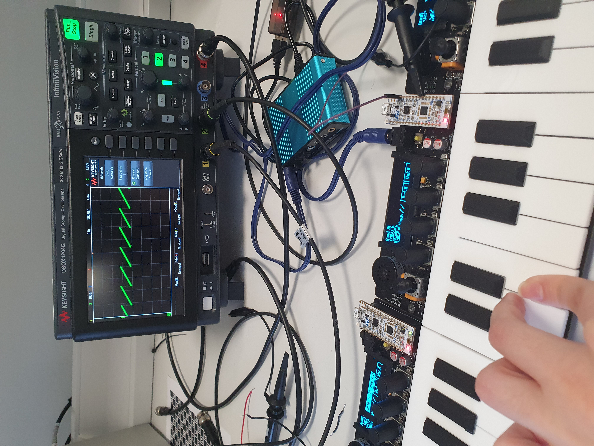
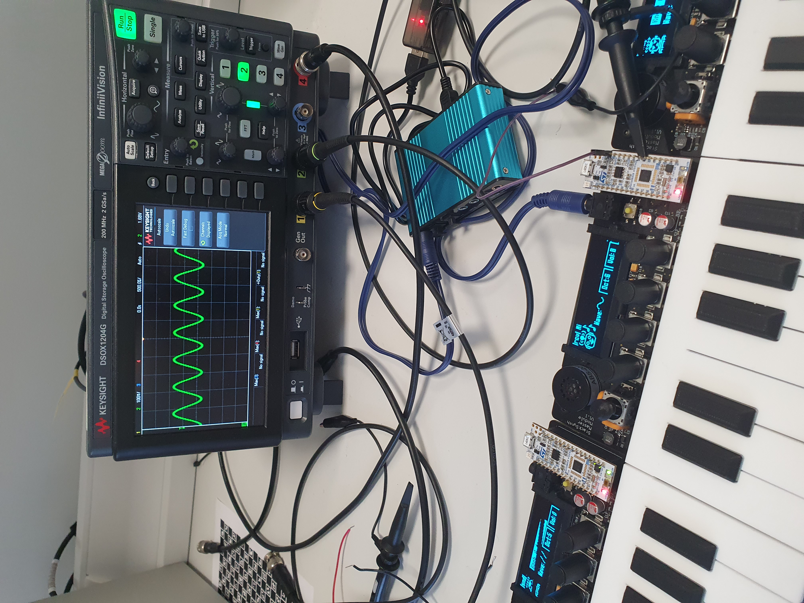
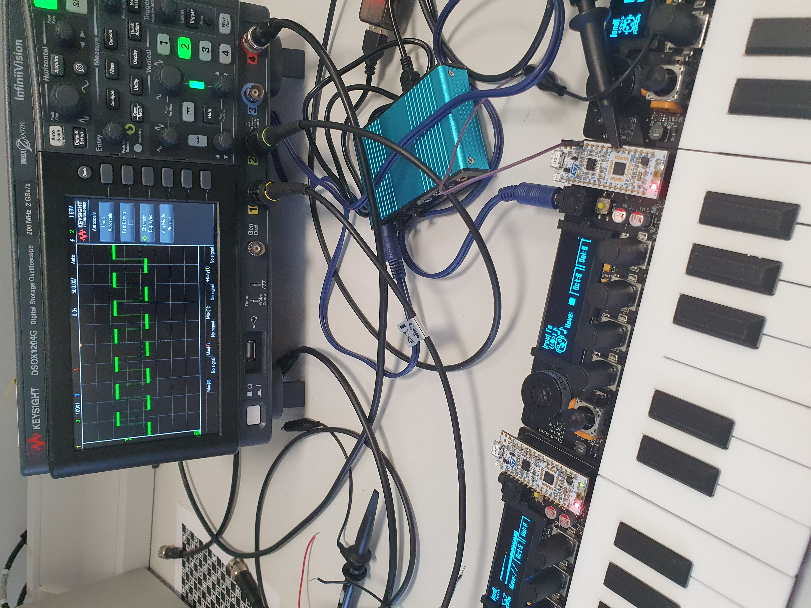
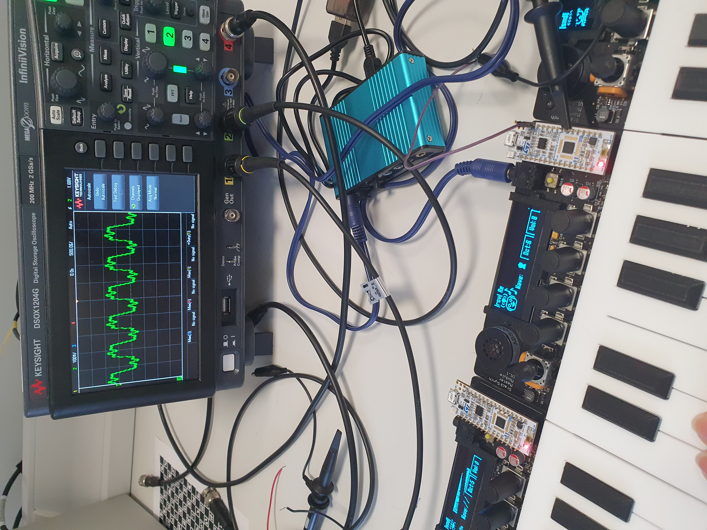
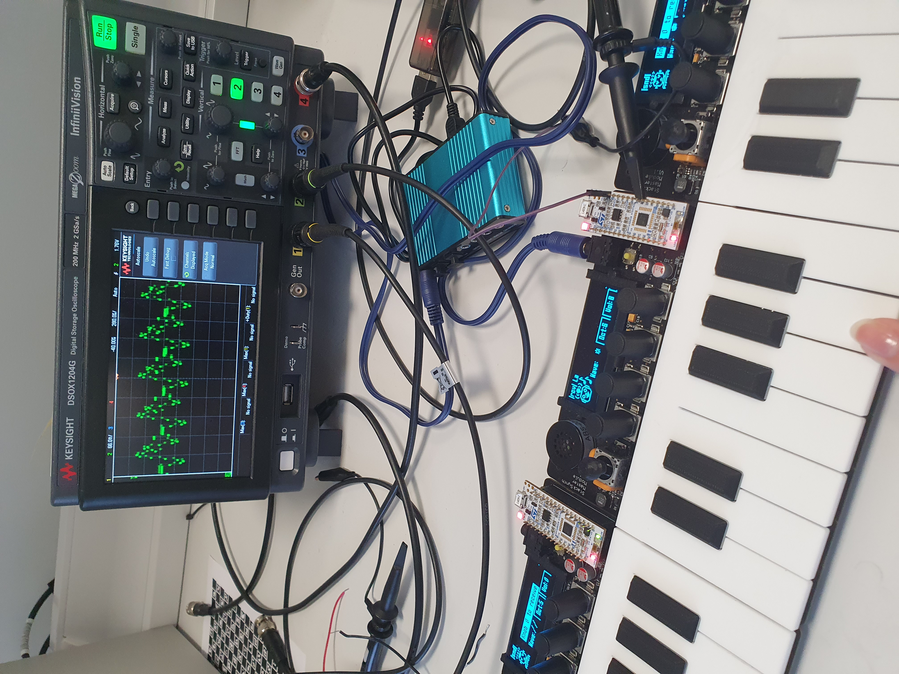
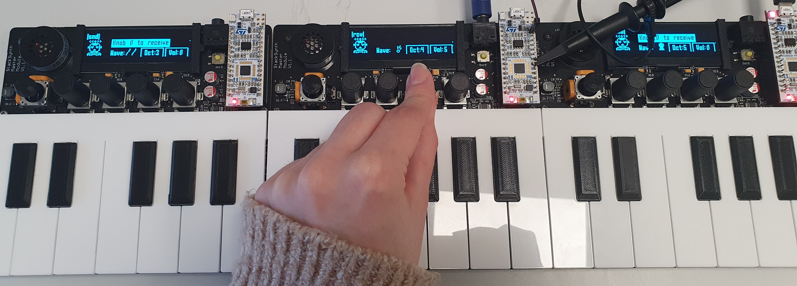

# charIOT-Key-C

## Table of Contents

<p style="padding-left:5%">
  <a href="#introduction">1. Introduction</a>
  <br>
  <a href="#hardware">2. Hardware</a>
  <br>
  <a href="#core-features">3. Core Features</a>
  <br>
  <a href="#advanced-features">4. Advanced Features</a>
  <br>
  <a href="#timing-analysis">5. Timing Analysis</a>
</p>

# Introduction
<div align=center>
  <button onclick="https://imperiallondon.sharepoint.com/:v:/r/sites/charIOT-EE/Shared%20Documents/General/Embedded-LiveVideo-doubleDEMO.mp4?csf=1&web=1&e=f771Mp"> Click here for DEMO videos</button>
  <p></p>
  
  <a href="https://imperiallondon.sharepoint.com/:v:/r/sites/charIOT-EE/Shared%20Documents/General/Embedded-KEYS-Features.mp4?csf=1&web=1&e=bOCvlk" target="_blank">
    
  </a>

  (Click on image to check out a Sharepoint Features Presentation video)
</div>

---

This repo contains the code and documentation for the second coursework of the Imperial College London ELEC60013 Embedded Systems course taught by Dr Ed Stott.

The project is built using STM's CubeIDE - meaning you need an installation of CubeIDE to build and run the project (or some experience with makefiles and the ARM compiler toolchain!).


<!--  -->

# Hardware

<div align=center>
    
</div>

Table:

| [RA2,RA1,RA0] | C0 | C1 | C2 | C3 |
| :-------------: | -- | -- | -- | -- |
| 0	| Key C	| Key C♯	| Key D	| Key D♯ | 
| 1	| Key E	| Key F	| Key F♯	| Key G | 
| 2	| Key G♯	| Key A	| Key A♯	| Key B | 
| 3	| Knob 3 A	| Knob 3 B	| Knob 2 A	| Knob 2 B | 
| 4	| Knob 1 A	| Knob 1 B	| Knob 0 A	| Knob 0 B | 
| 5	| Knob 2 S	| Knob 3 S	| Joystick S	| West Detect | 
| 6	| Knob 0 S	| Knob 1 S	| Unused	| East Detect | 
| 7	| Unused | Unused | Unused | Unused |

# Core Features

Code:

 ```c
uint8_t readCols(){
…
}
```

> **Warning**
> 
> Very loud sound through earphones!

# Advanced Features

1. ***Wave Forms Implemented***

<table align=center>
  <tr display="flex" flex-direction=row align-content=center >
    <th>
      
      <p>Sawtooth wave</p>
    </th>
    <th>
      
      <p>Sine wave</p>
    </th>
  </tr>
  
  <tr display="flex" flex-direction=row align-content=center >
    <th>
      
      <p>Square wave</p>
    </th>
    <th>
      
      <p>Triangle wave</p>
    </th>
  </tr>

  <tr display="flex" flex-direction=row align-content=center >
    <th>
      
      <p>Clarinet wave</p>
    </th>
    <th>
      
      <p>Retro 1 wave</p>
    </th>
  </tr>

  <tr display="flex" flex-direction=row align-content=center >
    <th>
      
      <p>Retro 2/Electric Guitar wave</p>
    </th>
  </tr>
</table>

-----------------------

2. ***Synchronisation of octaves***

The keyboards synchronise their state with the others on startup or restart. After a couple of seconds after startup, we can notice the octaves updating from the local value of 4 to the synchronised values depending on the number of keyboards connected at the time of the startup.

<table>
  <tr>
      
      <p>1) When we power the keyboards connected, their octaves will synchronise and will update from left to right as 2-3-4</p>
  </tr>
  <tr>
      
      <p>2) At any point during the usage, we can change the octave of the receiver board through rotating the knob. The octaves of the other boards will then update considering their relative waves to the receiver board.</p>
  </tr>
  <tr>
      
      <p>3) We continue rotating the octave knob and reach the maximum combination of octaves 6-7-8 that we allow in our system.</p>
  </tr>
</table>

# Timing Analysis


-----------------------
Won't work here, but tested on github and works: 
<a href="./Core/Src/main.c">Test relative link</a>

  * Unordered sub-list. 
1. Actual numbers don't matter, just that it's a number
  1. Ordered sub-list
4. And another item.

   You can have properly indented paragraphs within list items. Notice the blank line above, and the leading spaces (at least one, but we'll use three here to also align the raw Markdown).

   To have a line break without a paragraph, you will need to use two trailing spaces.  

   Note that this line is separate, but within the same paragraph.  

   (This is contrary to the typical GFM line break behaviour, where trailing spaces are not required.)

* Unordered list can use asterisks
- Or minuses
+ Or pluses

> **Note**: How much stack?
>
> hi 

the language name next to the code deffers the colour 

 ``` python
# comment here
def function():
  break
```